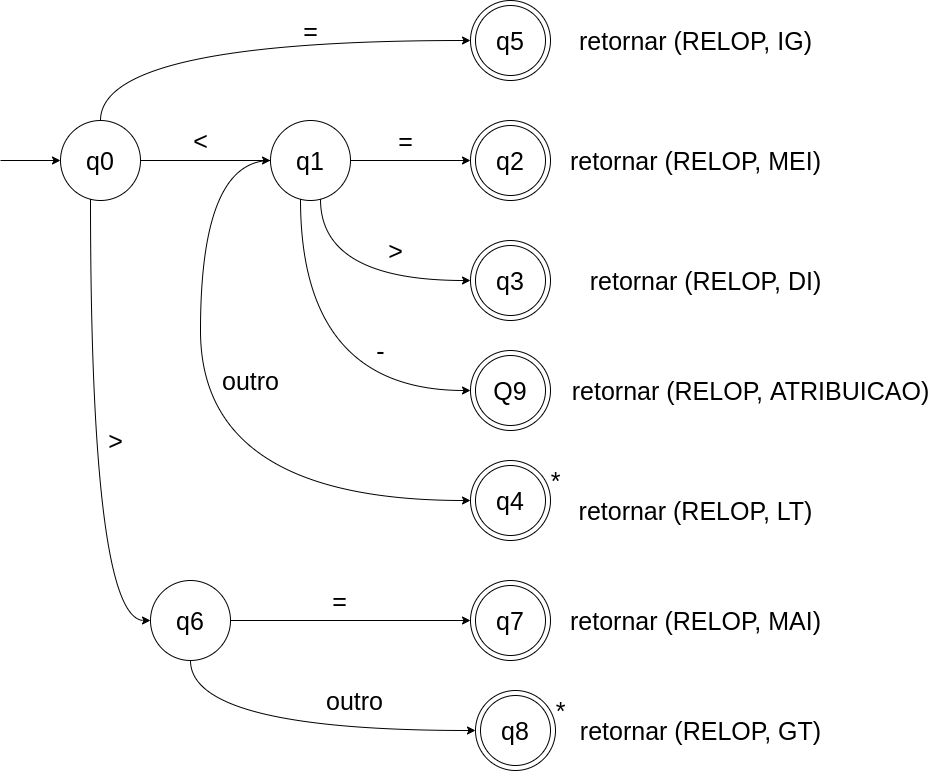
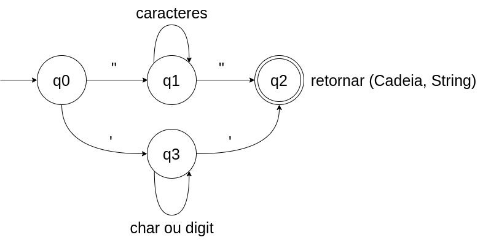
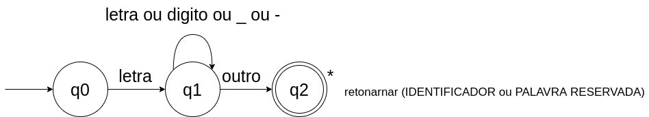
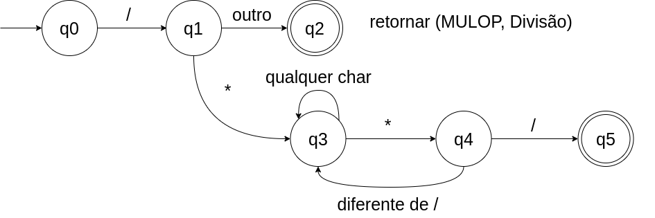

# Analisador Léxico

Grupo
<ul>
    <li>Clarice Dantas 1902815</li>
    <li>Leandro Santos RA 1901845</li>
    <li>Rafael Gallo RA 1901885</li>
    <li>Rodrigo Santiago RA 1902375</li>
    <li>Yago Rodrigues RA 1902362</li>
</ul>


## Principal dificuldade encontrada pelo grupo:
<li> A principal foi o tempo, como o projeto é muito trabalho e complexo demandou bastante tempo para conseguirmos entender os conceitos e implementar os codigos e depurar os erros, mas após rever algumas aulas conseguimos entender os conceitos de <b>AFD</b> e aplica-los no projeto.
<br>
<br>

## Retorno do Bash ao TESTE.PTL
```bash
$ python lexico.py TESTE.PTL

Linha: 1 - atomo: COMENTARIO 	lexema: /* 
   Programa teste
   Exemplo de teste para o analisador léxico
*/	valor: 0	operador: --
Linha: 3 - atomo: ALGORITMO 	lexema: ALGORITMO	valor: 0	operador: --
Linha: 3 - atomo: IDENTIF 	lexema: programa_teste	valor: 0	operador: --
Linha: 4 - atomo: VARIAVEIS 	lexema: VARIAVEIS	valor: 0	operador: --
Linha: 5 - atomo: INTEIRO 	lexema: INTEIRO	valor: 0	operador: --
Linha: 5 - atomo: IDENTIF 	lexema: X	valor: 0	operador: --
Linha: 6 - atomo: INICIO 	lexema: INICIO	valor: 0	operador: --
Linha: 7 - atomo: IDENTIF 	lexema: IMPRIMA	valor: 0	operador: --
Linha: 7 - atomo: RELOP 	lexema: (	valor: 0	operador: ABRE_PAR
Linha: 7 - atomo: STRING 	lexema: "TESTE\n"	valor: 0	operador: --
Linha: 7 - atomo: RELOP 	lexema: )	valor: 0	operador: FECHA_PAR
Linha: 8 - atomo: IDENTIF 	lexema: x	valor: 0	operador: --
Linha: 8 - atomo: RELOP 	lexema: <-	valor: 0	operador: ATRIBUICAO
Linha: 8 - atomo: NUM_INT 	lexema: 0	valor: 0	operador: --
Linha: 8 - atomo: RELOP 	lexema: ;	valor: 0	operador: PONTO_VIRGULA
Linha: 9 - atomo: ENQUANTO 	lexema: ENQUANTO	valor: 0	operador: --
Linha: 9 - atomo: RELOP 	lexema: (	valor: 0	operador: ABRE_PAR
Linha: 9 - atomo: IDENTIF 	lexema: X	valor: 0	operador: --
Linha: 9 - atomo: RELOP 	lexema: <=	valor: 0	operador: MEI
Linha: 9 - atomo: NUM_INT 	lexema: 10	valor: 10	operador: --
Linha: 9 - atomo: RELOP 	lexema: )	valor: 0	operador: FECHA_PAR
Linha: 9 - atomo: ENTAO 	lexema: ENTAO	valor: 0	operador: --
Linha: 10 - atomo: SE 	lexema: SE	valor: 0	operador: --
Linha: 10 - atomo: RELOP 	lexema: (	valor: 0	operador: ABRE_PAR
Linha: 10 - atomo: IDENTIF 	lexema: x	valor: 0	operador: --
Linha: 10 - atomo: RELOP 	lexema: %	valor: 0	operador: RESTO
Linha: 10 - atomo: NUM_INT 	lexema: 2	valor: 2	operador: --
Linha: 10 - atomo: RELOP 	lexema: =	valor: 0	operador: IG
Linha: 10 - atomo: NUM_INT 	lexema: 0	valor: 0	operador: --
Linha: 10 - atomo: RELOP 	lexema: )	valor: 0	operador: FECHA_PAR
Linha: 10 - atomo: ENTAO 	lexema: ENTAO	valor: 0	operador: --
Linha: 11 - atomo: IDENTIF 	lexema: IMPRIMA	valor: 0	operador: --
Linha: 11 - atomo: RELOP 	lexema: (	valor: 0	operador: ABRE_PAR
Linha: 11 - atomo: IDENTIF 	lexema: x	valor: 0	operador: --
Linha: 11 - atomo: RELOP 	lexema: )	valor: 0	operador: FECHA_PAR
Linha: 12 - atomo: FIM 	lexema: FIM	valor: 0	operador: --
Linha: 13 - atomo: IDENTIF 	lexema: X	valor: 0	operador: --
Linha: 13 - atomo: RELOP 	lexema: <-	valor: 0	operador: ATRIBUICAO
Linha: 13 - atomo: IDENTIF 	lexema: x	valor: 0	operador: --
Linha: 13 - atomo: ADDOP 	lexema: +	valor: 0	operador: ADICAO
Linha: 13 - atomo: NUM_INT 	lexema: 1	valor: 1	operador: --
Linha: 14 - atomo: FIM 	lexema: FIM	valor: 0	operador: --
Linha: 16 - atomo: FIM 	lexema: FIM	valor: 0	operador: --
Linha: 16 - atomo: EOS 	lexema: 	valor: 0	operador: --

```


# Automatos implementados durante o desenvolvimento:

## Trata operadores relacionais e atribuição:


```python
 def tratar_operador_menor(self, c):
        lexema = c
        estado = 1
        c = self.proximo_char()
        while True:
            # estado 1
            if estado ==1:
                if c == '=':
                    lexema = lexema + c
                    estado = 2
                elif c =='>':
                    lexema = lexema + c
                    estado = 3
                
                elif c =='-':
                    lexema = lexema + c
                    estado = 9
                else:
                    estado = 4
            
            # estado 2
            elif estado ==2:
                return Tolken(RELOP, lexema, 0, MEI, self.nlinha)
                

            # estado 3
            elif estado ==3:
                return Tolken(RELOP, lexema, 0, DI, self.nlinha)
                

            # estado 4
            elif estado ==4:
                return Tolken(RELOP, lexema, 0, MA, self.nlinha)

            # estado 9
            elif estado ==9:
                return Tolken(RELOP, lexema, 0, ATRIBUICAO, self.nlinha)

    def tratar_operador_maior(self, c):
        lexema = c
        estado = 6
        c = self.proximo_char()
        while True:
            if estado ==6:
                if c == '=':
                    lexema = lexema +c
                    estado = 7
                else:
                    self.retrac_char()
                    estado = 8

            elif estado == 7:
                return Tolken(RELOP,lexema, 0, MAI, self.nlinha) 
            
            elif estado == 8:
                return Tolken(RELOP, lexema, 0, ME, self.nlinha)


```


## para reconhece Strings:


### Código:

```python
def tratar_string(self, c):
        lexema = c
        estado = 0
        c = self.proximo_char()

        while True:
            if estado == 0:
                if lexema == '"':
                    estado = 1
                else:
                    estado = 3

            elif estado == 1:
                if c == '"':
                    lexema = lexema + c
                    estado = 2
                else:
                    lexema = lexema + c
                    estado = 1
                    c = self.proximo_char()

            elif estado ==2:
                return Tolken(STRING,lexema, 0, 0, self.nlinha)

            elif estado == 3:
                if c == "'":
                    lexema = lexema + c
                    estado = 2
                else:
                    lexema = lexema + c
                    estado = 3
                    c = self.proximo_char()       
```

## Trata Identificador e palavras chaves:


```python
def tratar_identificador(self, c):
        lexema = c
        c = self.proximo_char()
        estado = 1

        while True:
            if estado ==1:
                if c.isdigit() or c.isalpha() or c =='_' or c =='-':
                    lexema = lexema + c
                    estado = 1
                    c = self.proximo_char()
                else:
                    estado = 2
            elif estado ==2:
                self.retrac_char()
                if lexema.upper() in palavras_reservadas:
                    codigo = palavras_reservadas[lexema.upper()]
                    return Tolken(codigo, lexema.upper(), 0, 0, self.nlinha)
                else:
                    return Tolken(IDENTIFICADOR, lexema, 0, 0, self.nlinha)

```
## Trata divisão e comentarios:


```python
def tratar_divcomentario(self, c):
        lexema = c
        c = self.proximo_char()
        estado = 1

        while True:
            if estado == 1:
                if c == '*':
                    estado = 3
                    lexema = lexema + c
                    c = self.proximo_char()
                else:
                    estado =2

            elif estado == 2:
                self.retrac_char()
                return Tolken(MULOP,lexema, 0,DIVISAO, self.nlinha)
            
            elif estado ==3:
                if c == '*':
                    estado = 4
                    lexema = lexema + c
                    c = self.proximo_char()
                else:
                    lexema = lexema + c
                    estado = 3
                    c = self. proximo_char()
            
            elif estado ==4:
                if c =='/':
                    lexema = lexema + c
                    estado = 5
                    #c = self.proximo_char()
                else:
                    lexema = lexema + c
                    estado = 3
                    c = self.proximo_char()

            elif estado ==5:
                return Tolken(COMENTARIO,lexema,0, 0, self.nlinha)
```

## os demais são tratados na função **proximo_tolken()** no programa.


